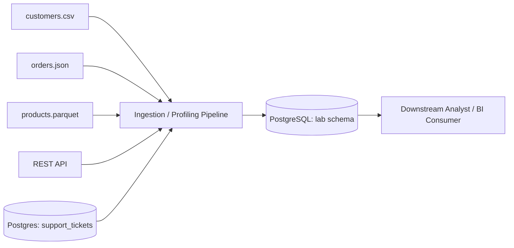

# Data Engineering Lifecycle Map

| Lifecycle Element | What It Means | Example in This Lab | Primary Tool/Artifact | Possible Failure |
|---|---|---|---|---|
| Source system | Where raw data originates, outside the pipeline's control | `customers.csv`, `orders.json`, `products.parquet`, the REST API, and the Postgres `support_tickets` table | Files in `data/raw/`; API endpoint; Docker Postgres container | Source changes schema/format without notice; source goes offline |
| Ingestion/acquisition | Pulling data from a source into the environment you control | Reading CSV/JSON/Parquet with pandas; `GET` request via `requests` | `profile_sources.py`, `inspect_api.py` | API timeout, auth expiry, malformed or truncated file, rate limiting |
| Storage | Where acquired data is persisted for later use | `data/raw/` for files; PostgreSQL for the formalized source | Docker volume `postgres_data`; local filesystem | Disk full; volume not mounted; data lost when a container is removed without a persistent volume |
| Processing/transformation | Cleaning, joining, reshaping, or deriving new fields from raw data | Computing null counts, dtypes, and distinct-value counts (deliberately not transforming yet) | pandas | Silent type coercion (e.g., IDs read as floats); rows dropped by a bad join or filter |
| Data quality/validation | Checking that data meets defined expectations before it is trusted | Null/duplicate counts in `profile_sources.py`; `CHECK` constraints in `01_create_schema.sql` | `profile_sources.py`, `01_create_schema.sql`, `data_contract.yaml` | Bad data passes undetected because no rule was ever written for it |
| Delivery | Making processed, trusted data available to whoever needs it next | Loading validated records into `lab.customers` | SQL `INSERT`/`COPY`, or a scheduled batch job in production | Partial load leaves the table inconsistent; schema mismatch causes the load to fail |
| Consumer | The person or system that uses the delivered data | The analytics team building segmentation reports/dashboards | BI tool, ad hoc SQL, downstream ML feature pipeline | Consumer misinterprets an ambiguous field because no contract explained it |

## Source-to-Consumer Flow Diagram

